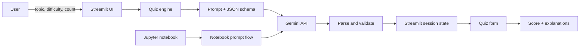

# 🧠 QuizGenius AI

> Turn any topic into a validated, interactive multiple-choice quiz with Google Gemini, Python and Streamlit.

QuizGenius AI is an end-to-end NLP capstone with two complementary delivery modes:

- **Jupyter notebook:** a transparent learning workflow for prompt design, Gemini integration, JSON parsing and terminal-based quiz execution.
- **Streamlit application:** a product-oriented web experience with configurable generation, persistent session state, answer submission, scoring and explanations.

The notebook and Streamlit application are deliberately independent. The web application does not execute or import the notebook; both call Gemini through their own clearly defined flow.

---

## ✨ What the project does

1. Accepts a topic, difficulty and desired question count.
2. Builds an explicit quiz-generation prompt.
3. Calls Gemini through the current `google-genai` client.
4. Requests structured JSON containing a title, questions, four options, the correct option and an explanation.
5. Sanitizes, parses and validates the response before it reaches the UI.
6. Presents the quiz as an interactive command-line exercise or a Streamlit form.
7. Scores submitted answers and provides question-level educational feedback.

The Streamlit implementation supports **1–10 questions** and **Beginner, Intermediate and Advanced** difficulty levels.

---

## 🏗️ Architecture and workflow



### Functional workflow

- `app.py` owns presentation and interaction.
- `quiz_engine.py` owns Gemini communication and domain validation.
- `st.session_state` preserves generated questions and submitted answers across Streamlit reruns.
- `st.form` batches quiz answers so scoring happens only after explicit submission.
- The notebook provides a readable instructional version without coupling itself to the web app.

### Reliability safeguards

- Gemini output is constrained with a JSON response schema.
- Topic, difficulty and question-count inputs are validated before the API call.
- Every generated question must contain exactly options `A`, `B`, `C` and `D`.
- Correct-answer references are checked against the available options.
- Empty responses, malformed JSON and incomplete structures fail with clear errors.
- macOS uses the system trust store while keeping TLS verification enabled.

---

## 📁 Project structure

```text
quizgenius/
├── app.py                         # Streamlit UI, forms, state and scoring
├── quiz_engine.py                 # Gemini client, prompt, schema and validation
├── requirements.txt               # Streamlit runtime dependencies
├── notebook/
│   └── quizgenius.ipynb           # Independent instructional notebook
├── .streamlit/
│   └── secrets.toml.example       # Safe Streamlit secret template
├── .env.example                   # Safe environment-variable template
├── .gitignore                     # Secret and generated-file exclusions
└── README.md                      # Project guide and architecture overview
```

Local virtual environments, real secrets, caches and notebook checkpoints are intentionally excluded from version control.

---

## 🛠️ Technology stack

| Layer | Technology | Purpose |
|---|---|---|
| Language | Python 3.11+ | Application and notebook runtime |
| Generative AI | Google Gemini | Quiz-content generation |
| SDK | `google-genai` | Gemini client and structured output configuration |
| Web UI | Streamlit | Interactive setup, answering and scoring |
| Validation | JSON Schema + Python checks | Predictable model output |
| Notebook | Jupyter | Educational, inspectable execution path |
| Security | Environment variables / Streamlit secrets | Credentials outside source control |
| TLS | `truststore` | Trusted OS certificates on macOS |

---

## 🔐 Configure Gemini securely

Create a Gemini API key in Google AI Studio. Never paste a real key into source code, a notebook cell, a committed `.env` file or Git history.

The safe placeholder used by this repository is:

```bash
GEMINI_KEY='GEMINI_API_VALUE'
```

Replace it only in your local shell or ignored configuration. The Streamlit app accepts `GEMINI_KEY` and the conventional `GEMINI_API_KEY` alias. The notebook uses `GEMINI_API_KEY` or a Colab secret with that name.

### macOS/Linux shell

```bash
export GEMINI_KEY='GEMINI_API_VALUE'
```

### Windows PowerShell

```powershell
$env:GEMINI_KEY='GEMINI_API_VALUE'
```

### Streamlit secrets

Copy `.streamlit/secrets.toml.example` to the ignored `.streamlit/secrets.toml`:

```toml
GEMINI_KEY = "GEMINI_API_VALUE"
```

Replace the placeholder locally. Never commit `secrets.toml`.

---

## 🚀 Run the Streamlit application

### macOS/Linux

```bash
git clone https://github.com/khshaik/nlp-labs.git
cd nlp-labs/quizgenius

python3 -m venv .venv
source .venv/bin/activate
python -m pip install --upgrade pip
python -m pip install -r requirements.txt

export GEMINI_KEY='GEMINI_API_VALUE'
python -m streamlit run app.py
```

### Windows PowerShell

```powershell
git clone https://github.com/khshaik/nlp-labs.git
cd nlp-labs\quizgenius

py -m venv .venv
.\.venv\Scripts\Activate.ps1
python -m pip install --upgrade pip
python -m pip install -r requirements.txt

$env:GEMINI_KEY='GEMINI_API_VALUE'
python -m streamlit run app.py
```

Open <http://localhost:8501> if Streamlit does not open it automatically.

---

## 📓 Run the Jupyter notebook

The notebook is standalone and can run locally or in Google Colab.

### Local Jupyter

```bash
cd nlp-labs/quizgenius
python3 -m venv .venv
source .venv/bin/activate                 # Windows: .\.venv\Scripts\Activate.ps1
python -m pip install jupyter google-genai
export GEMINI_API_KEY='GEMINI_API_VALUE'  # Windows: $env:GEMINI_API_KEY='GEMINI_API_VALUE'
jupyter notebook notebook/quizgenius.ipynb
```

Restart the kernel and select **Run All** after dependency installation.

### Google Colab

1. Open `notebook/quizgenius.ipynb` in Colab.
2. Open **Secrets** from the left sidebar.
3. Add `GEMINI_API_KEY` and enable notebook access.
4. Select **Runtime → Restart session and run all**.

---

## 🏭 Productization notes

The project separates UI concerns from model-integration logic, providing a clean path beyond a classroom prototype:

- Deploy `app.py` to Streamlit Community Cloud and configure platform secrets.
- Add authentication, rate limiting and per-user quotas before public exposure.
- Cache safe reusable results to reduce latency and API cost.
- Add structured monitoring without recording prompts, answers or secrets unnecessarily.
- Add deterministic CI tests with mocked Gemini responses.
- Introduce content-safety and age/domain controls for broader audiences.
- Persist attempts only after defining retention and privacy policies.
- Pin exact dependencies or adopt a lockfile for reproducible builds.

---

## 🧪 Verification checklist

```bash
python -m compileall -q app.py quiz_engine.py
python -m streamlit run app.py --server.headless true
```

Then generate a three-question quiz, submit all answers, confirm the score and explanations, and verify that **Create another quiz** resets the state.

---

## ⚠️ Responsible use and limitations

- LLM-generated questions can contain factual errors or ambiguity; review high-stakes educational content.
- API calls may incur usage charges and are subject to provider limits.
- Quality depends on topic specificity and model availability.
- Do not send confidential, regulated or personally identifiable information as a quiz topic.
- This repository intentionally contains placeholder credentials only.

---

## 📄 License

This project follows the license at the root of the `nlp-labs` repository.
